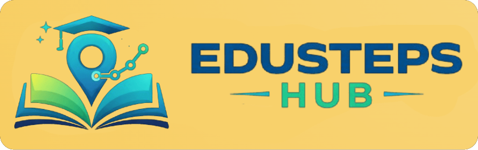
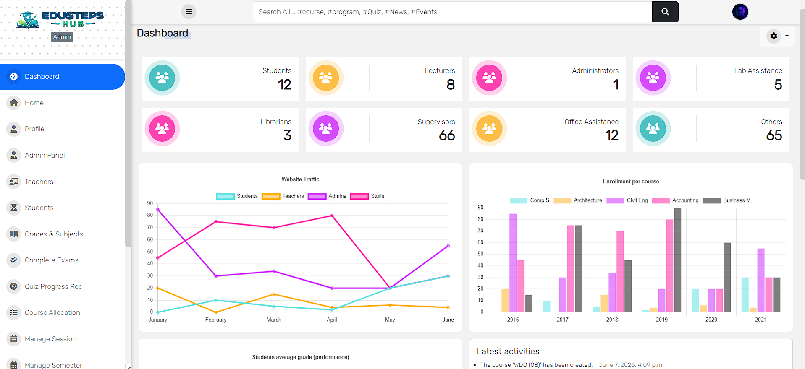

<div align="center">

### Modern, lightweight, and feature-rich Learning Management System built with Django

# 🚀 Edusteps Hub

An open-source Learning Management System (LMS) built using the Django web framework.
### *An enterprise-grade, lightweight, and modular Learning Management System (LMS) built on the Django framework.*

[](https://www.python.org)
[](https://www.djangoproject.com)
[](LICENSE)
[](CONTRIBUTING.md)

[Explore Documentation](##documentation) • [Core Architecture](##core-architecture--features) • [Deployment Blueprint](##quickstart--deployment-blueprint) • [Report Issues](https://github.com/fahmitofik/EDUSTEPSHUB/issues)

</div>

Edusteps Hub is designed for schools, colleges, universities, training centers, and independent educators who need a flexible and powerful platform for managing academic activities online.

Whether you're building an educational platform for production use or learning Django through a real-world project, Edusteps Hub provides a solid foundation for development and customization.

Our goal is to create a modern, scalable, and user-friendly LMS while keeping the project lightweight and accessible to developers of all experience levels.

⭐ If you find this project useful, consider starring the repository and contributing to its growth.

> ⚡ **Operational Status:** Production-ready framework optimized for rapid deployment, role-based security isolation, and automated academic workflows.
---

## Documentation

Documentation is currently under development and will continue to improve with community contributions.

We welcome developers, educators, and open-source enthusiasts to help improve the platform.

---

## Preview

<div align="center">
  
</div>

---

# Features

## Administration

- Administrative dashboard with analytics and system overview
- Student management (Create, Update, Delete)
- Lecturer management (Create, Update, Delete)
- Academic session and semester management
- News and events management
- Role-based access control and permissions

## Student Management

- Course registration
- Add and drop courses
- Assessment and grade tracking
- Registration slip generation
- Academic result management

## Grading System

- Attendance scoring
- Assignment scoring
- Midterm examination scoring
- Final examination scoring
- Automatic calculation of:
  - Total Score
  - Average Score
  - Grade Point
  - Final Grade
- Pass/Fail evaluation
- Academic warning notifications

## Learning Resources

- Course material uploads
- PDF document support
- Video content support
- Resource management per course

## Quiz & Assessment System

Powered by the Django Quiz framework and integrated into Edusteps Hub.

Features include:

- Quiz result storage
- Randomized question order
- Category-based quizzes
- Previous attempt tracking
- One-attempt quiz restriction
- Progress tracking by category
- Configurable pass marks
- Detailed explanations for answers
- Custom success and failure messages
- Quiz statistics and monitoring

### Supported Question Types

- Multiple Choice Questions (MCQ)
- True / False Questions
- Essay Questions _(Coming Soon)_

### Advanced Features

- Resume incomplete quizzes
- Session persistence support
- Quiz review and marking interface
- Essay grading workflow
- Custom permissions for viewing quiz reports

---

# Roadmap

Future features and planned improvements are listed in the `TODO.md` file.

Contributors are encouraged to select tasks from the roadmap and submit pull requests.

---

# Requirements

The following software is required:

- Python 3.11.9

---

# Installation

## Clone the Repository

```bash
git clone [https://github.com/fahmitofik/EDUSTEPSHUB.git](https://github.com/fahmitofik/EDUSTEPSHUB.git)
cd EDUSTEPSHUB
```

## Create a Virtual Environment

```bash
python -m venv venv
```

Activate the environment:

### Windows

```bash
venv\Scripts\activate
```

### Linux / macOS

```bash
source venv/bin/activate
```

## Install Dependencies

```bash
pip install --upgrade pip
pip install -r requirements.txt
```

## Configure Environment Variables

Create a `.env` file in the project root.

Copy the contents of:

```bash
cp .env.example .env
```

Then update the values according to your local environment.

## Execute Database Schema Migrations

```bash
python manage.py migrate
```

## Provision Administrative Credentials

```bash
python manage.py createsuperuser
```

## Spin up local development engine

```bash
python manage.py runserver
```

Open your browser and visit:

```text
http://127.0.0.1:8000
```

---

# Technology Stack

- Django
- Python
- Bootstrap
- SQLite (default)
- PostgreSQL (recommended for production)

---

# Project Structure

```text
Edusteps Hub
├── accounts
├── core
├── course
├── quiz
├── result
├── templates
├── static
├── media
└── config
```

---

# Credits

This project is based on and inspired by:

- Django LMS Starter by Fahmi Tofik
- Django Quiz by Fahmi Tofik

Special thanks to all open-source contributors who make educational software accessible to everyone.

---

# Contributing

Contributions are always welcome.

Please read:

- CONTRIBUTING.md
- CODE_OF_CONDUCT.md

before submitting issues or pull requests.

---

# License

This project is distributed under the license included in the repository.

See the `LICENSE` file for details.

---

# Support the Project

If Edusteps Hub helps you in your work, studies, or development journey:

⭐ Star the repository

🍴 Fork the project

🚀 Contribute new features

📢 Share it with others

Together we can build a powerful open-source learning platform for everyone.
